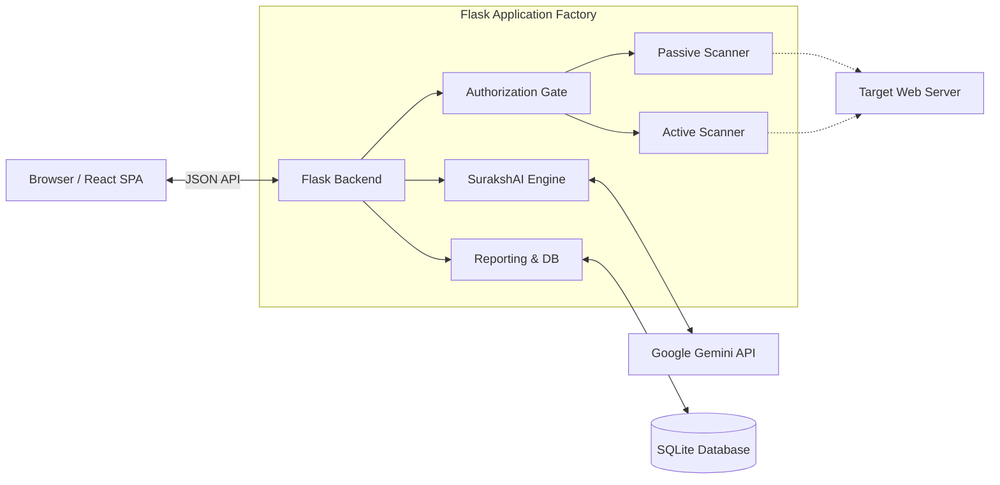

# WebSec-SurakshAI 🛡️

<div align="center">


> **One tool. Two shields. Zero compromise.**
>
> A unified Cybersecurity & Digital Forensics platform combining an advanced Web Security Scanner with AI-powered Fraud Detection.

</div>

---

## 🛑 Problem Statement: The Fragmentation of Security Tools

Today, investigating security threats requires hopping between disconnected tools.

| What you need to check | Before WebSec-SurakshAI ❌ | With WebSec-SurakshAI ✅ |
| :--- | :--- | :--- |
| **TLS/Certificate Health** | SSL Labs (External Site) | Built-in Passive Scanner |
| **HTTP Header Hygiene** | SecurityHeaders.com | Built-in Passive Scanner |
| **Phishing / Reputation** | PhishTank / GSB Lookups | Automatic cross-referencing |
| **Active Vulnerabilities** | Burp Suite / ZAP (Complex UI) | Built-in Active Scanner (Gated) |
| **SMS/Email Scam Analysis**| ScamShield apps (Separate Ecosystem) | Built-in SurakshAI Engine |

**WebSec-SurakshAI** eliminates this fragmentation by providing a single, beautiful React-powered dashboard where you can assess web vulnerabilities *and* analyze suspicious messages, links, and emails using Google Gemini AI.

---

## ✨ Features

### 🤖 SurakshAI Engine (AI-Powered Fraud Detection)
- **Message Analysis**: Detects SMS, WhatsApp, and social media scams in English, Hindi, and Hinglish.
- **Link Intelligence**: Analyzes URLs for typosquatting, TLD abuse, and suspicious TLS structures without fetching malicious payloads.
- **Email Forensics**: Parses RFC 5322 emails, validating SPF, DKIM, and DMARC signatures alongside semantic analysis of the email body.
- **Indian Context**: Specifically trained to recognize UPI fraud, KYC scams, fake job offers, and government impersonation (e.g., CBI/Income Tax).

### 🔍 WebSec Passive Scanner (Safe on any URL)
- **TLS/SSL Certificates**: Checks expiry, issuer trustworthiness, and protocol deprecation.
- **Security Headers**: Verifies CSP, HSTS, X-Frame-Options, X-Content-Type-Options, and CORS.
- **Cookie Security**: Flags missing `Secure`, `HttpOnly`, and `SameSite` attributes.
- **Domain Intelligence**: Integrates Google Safe Browsing, PhishTank, and WHOIS domain age lookups.

### ⚡ WebSec Active Scanner (Authorization Gated)
- **SQL Injection**: Detects Error-based, Boolean-based, and Time-based SQLi.
- **Cross-Site Scripting**: Tests for Reflected and Stored XSS payloads.
- **Command Injection**: Tests OS command separators.
- **YAML Extensibility**: Add new attack payloads via YAML files without writing Python code.
- **Built-in Sandbox**: Includes a vulnerable Flask app (on port 5001) for safe testing and learning.

### 📊 Reporting & AI Remediation
- **Risk Scoring**: Severity-weighted A–F grading system (0-100 score).
- **Scan Diffing**: Compare current scans with previous ones to track remediation progress.
- **AI Remediation**: Gemini generates step-by-step, actionable fix plans tailored to your specific findings.
- **Export Options**: Export reports to JSON (for CI/CD pipelines) or PDF (for stakeholders).

---

## 🏛 Architecture

WebSec-SurakshAI uses a modern decoupled architecture. The frontend is a React Single Page Application (SPA), while the backend is a modular Flask application.



---

## 🛠 Tech Stack

| Component | Technology | Why Chosen? |
| :--- | :--- | :--- |
| **Frontend UI** | React 18, Vite, Framer Motion | High-performance SPA with smooth, professional animations. |
| **Backend Core** | Flask 3.x, Gunicorn | Lightweight, extensible Python framework perfect for security tooling. |
| **AI Intelligence**| `google-genai` (Gemini 2.0 Flash) | Fast, highly capable LLM with a large context window for log/email parsing. |
| **Data Parsing** | `tldextract`, `dkimpy`, `dnspython` | Accurate domain extraction and cryptographic email verification. |
| **Database** | SQLite + SQLAlchemy ORM | Zero-config local storage, easily portable. |
| **Reporting** | `xhtml2pdf` | Generates professional PDFs without relying on heavy C-libraries or headless browsers. |

---

## 🖥️ User Interface Overview

The interface features a dark, modern security aesthetic.

### SurakshAI Dashboard
```text
┌─────────────────────────────────────────────────────────────┐
│ 🛡️ WebSec-SurakshAI                       [Dashboard] [Logout]│
├─────────────────────────────────────────────────────────────┤
│  [ Message Analyzer ]  [ URL Analyzer ]  [ Email Analyzer ] │
│                                                             │
│  Paste suspicious content here:                             │
│  ┌───────────────────────────────────────────────────────┐  │
│  │ Dear Customer, your SBI account is blocked. Click     │  │
│  │ here to update KYC: http://sbi-update-kyc.net/login   │  │
│  └───────────────────────────────────────────────────────┘  │
│                                           [ Analyse ]       │
│                                                             │
│  AI Verdict: 🔴 SCAM (Confidence: 95%)                       │
│  Category: BANKING_FRAUD  |  Tactics: URGENCY, IMPERSONATION│
└─────────────────────────────────────────────────────────────┘
```

---

## 🚀 Quick Start

### 1. Clone the Repository
```bash
git clone https://github.com/YaduvanshiHimanshunfsu/WebSec-SurakshAI.git
cd WebSec-SurakshAI
```

### 2. Configure Environment
Copy the example environment file and add your keys (Gemini API key is required for AI features).
```bash
cp .env.example .env
# Edit .env to add GEMINI_API_KEY, set a secure ADMIN_PASSWORD, etc.
```

### 3. Start the Application
The `run.py` launcher handles everything: checking dependencies, building the frontend, and starting the server.

```bash
# Auto-install dependencies and start the app
python run.py --install
```

*(Note: Requires Node.js installed to build the React frontend for the first time).*

### 4. Access the Dashboard
Open your browser to: **http://localhost:5000**
- **Default Password**: `changeme123` (or whatever you set in `.env`)

### 5. Start the Sandbox (Optional)
To test the Active Scanner safely, start the included vulnerable sandbox:
```bash
python run.py --with-sandbox
```
The sandbox runs on port 5001.

---

## 🎯 Who Can Use It?

| User Profile | Use Case |
| :--- | :--- |
| **Security Analysts / Bug Hunters** | Reconnaissance, passive footprinting, and automated payload injection. |
| **Web Developers** | Validating headers, TLS configuration, and cookie security before deploying to production. |
| **Digital Forensics Investigators**| Parsing raw email headers (EML) to trace sender authenticity and DMARC/DKIM/SPF failures. |
| **Everyday Users / NGOs** | Verifying if a suspicious WhatsApp message, SMS, or link is a scam using AI. |
| **Cybersecurity Students** | Learning about vulnerabilities by scanning the built-in Sandbox application. |

---

## 👨‍💻 Developer & Attribution

**Himanshu Yadav**  
*National Forensic Sciences University (NFSU), Tripura Campus*

Built with a vision to democratize cybersecurity and provide a unified, intelligent defense mechanism against the rising tide of digital fraud and web vulnerabilities in India and globally.

---
*For detailed API documentation, see [docs/API.md](docs/API.md).*  
*For architectural details, see [docs/ARCHITECTURE.md](docs/ARCHITECTURE.md).*
