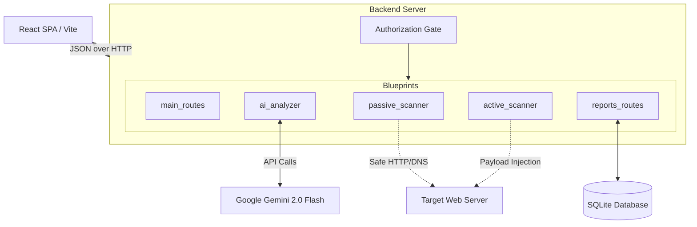

# Architecture & Design

WebSec-SurakshAI uses a modern decoupled architecture. The frontend is a React Single Page Application (SPA), while the backend is a modular Flask application using the Application Factory pattern.

## High-Level Flow

## Backend Blueprints

The backend is split into logical blueprints for maintainability:

1. **`main_routes`**: Handles the React frontend serving, authentication (login/logout), and basic dashboard stats.
2. **`ai_analyzer`**: The core of the SurakshAI engine. Handles message, URL, and email analysis. Uses `google-genai` and falls back to rule-based analysis if offline.
3. **`passive_scanner`**: Orchestrates safe, non-intrusive checks (TLS, HTTP Headers, Cookie flags, Google Safe Browsing, PhishTank, WHOIS). Emits Server-Sent Events (SSE) to the frontend.
4. **`active_scanner`**: Handles intrusive payload injection (SQLi, XSS, CMDi) using YAML templates. **Gated** behind strict DNS TXT record authorization.
5. **`reports_routes`**: Generates JSON and PDF reports and handles Risk Scoring.

## Frontend Architecture

The frontend is built with React 18, Vite, and Framer Motion for smooth transitions.

- **Routing**: Internal state-based routing between tabs (Dashboard, Scanner, AI Analysis).
- **State**: Centralized context for scan results and AI findings.
- **Styling**: Pure vanilla CSS (`index.css`) with CSS variables for a dark, cyber-security aesthetic.

## Authorization Gate

To prevent abuse, the Active Scanner implements an Authorization Gate. 
Before an active scan can start on an external target, the user must prove ownership of the domain by placing a specific TXT record in their DNS configuration. Localhost and the built-in Sandbox (port 5001) are bypassed.

## Extensibility

The Active Scanner is driven by YAML templates (located in `app/payload_templates/`). This means new vulnerabilities can be added by simply creating a new YAML file, without touching the Python execution engine.
